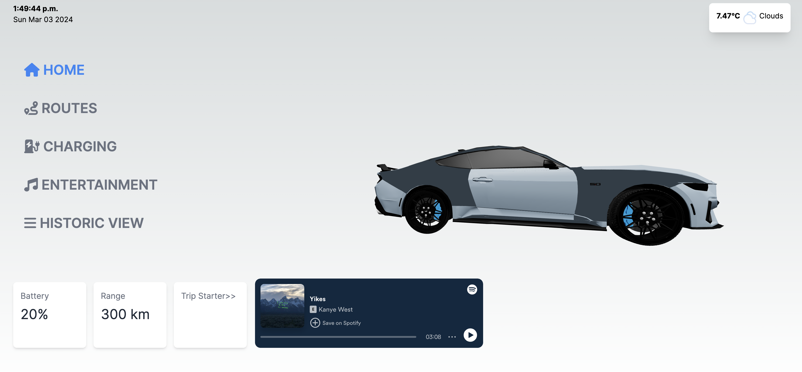
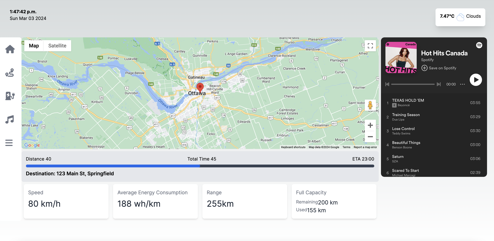
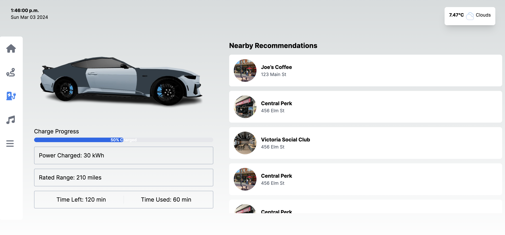

# uOttaHack Project: Hello Eve

## Project Related Links: 
- [Project demo](https://youtu.be/M_h1HcipcVk?si=FVA-zzkjDxdESjUn)
- [Devpost](https://devpost.com/software/hello-eve)

## Inspiration
Eve the robot from WALL-E for its intelligence.

## What it does
It serves as a virtual assistant to help EV drivers plan their trip ahead, and will understand your habits and knows how to improve their driving experience. In case they need to stop somewhere on the road for charging, it also provides tentative plan to spend good quality time like drinking coffee, seeing the scenery or having a lunch, depending on the time of the day, season and region.

## How we built it
- Backend:
  -  Node.js and Express to facilitate our backend framework, making sure the structure is maintanable according the MVC design.
  - For searching and requesting routes, nearby location of various types, we chose Google Map APIs. 
  - For interpreting the human speech input to further automate the assistant, we used Cohere APIs for speech to text, and intention detection process.
- Frontend:
  - Next.js,three.js, tailwind css 

## Challenges we ran into
- Harnessing the complexity of APIs, and how to simplify the client-server side communication.

## Accomplishments that we're proud of
- We have successfully integrated natural language processing into our solution, to efficiently identify user intentions, and direct the following steps to execute driven by AI.
- First time integrating three.js 3D model to Next.js. 

## What we learned
- Product design that solves problems for a certain group of people. Make good use of the resources you have that aligns with the given scenario.
- Using R3E to integrate 3D model with NextJS. 

## What's next for Hello Eve
- Continue to integrate AI and make improvements on giving advice that is more ad-hoc and considering.

## Project Interface 

